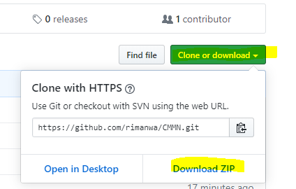
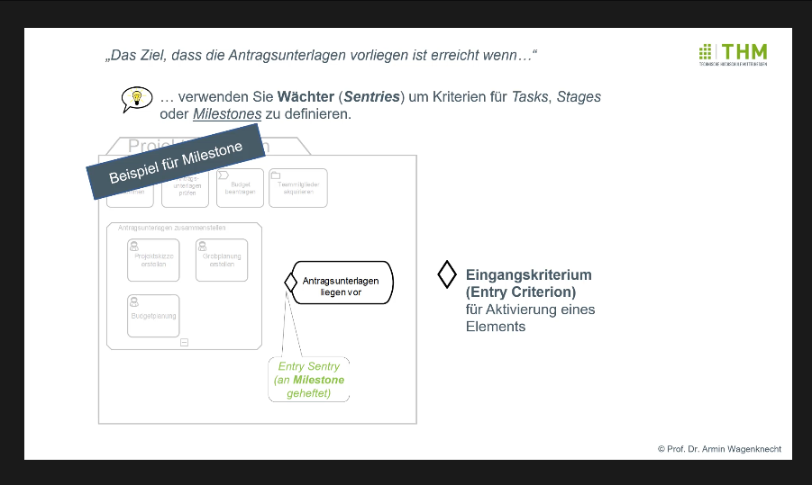

# Selbstlernvideos zur Case Management Model and Notation (CMMN) Version 1.1

<a href="#footer">Download des Lernmaterials (ca. 70MB)</a>

Selbst-Lernvideos in deutscher Sprache zum OMG-Standard CMMN Case Model and Notation (Version 1.1) für Lehrveranstaltung und Weiterbildungen

- [4 Videoclips a ca. 8 Minuten CMMN](Lernvideos)
  - an einem durchgängigen Anwendungsbeispiel erklärt (die Notation wird also direkt am Beispiel erklärt)
  - Vertonte, animierte Folien (speziell für die Videos erstellt)
- Einige [Multiple-Choice-Kontrollfragen](Kontrollfragen) zu jedem Clip
- Eine [CMMN-Modellierungsaufgabe](Uebungsaufgabe) "Klausur durchführen" inklusive Lösungsvorschlag

Die Selbst-Lernvideos wurden schon einige Male in einer Lehrveranstaktung eingesetzt. Die Studierenden gaben positive Rückmeldungen. Zudem konnte die Modellierungsaufgabe von den meisten sehr gut eigenständig auf Basis der Videos gelöst werden. 

Autor:  Prof. Dr. Armin Wagenknecht (armin.wagenknecht@mni.thm.de)

 Selbstlernvideos zur Case Management Model and Notation (CMMN 1.1.) von  Armin Wagenknecht ist lizenziert unter einer <a rel="license" href="https://creativecommons.org/licenses/by-nd/4.0/">Creative Commons Namensnennung - Weitergabe unter gleichen Bedingungen 4.0 International Lizenz</a>.

### Download
Download des gesamten Lernmaterials als ZIP-Archiv (ca. 70 MB) über den grünen Button rechts oben (siehe nachfolgendes Bild)

### Screenshot Videos

