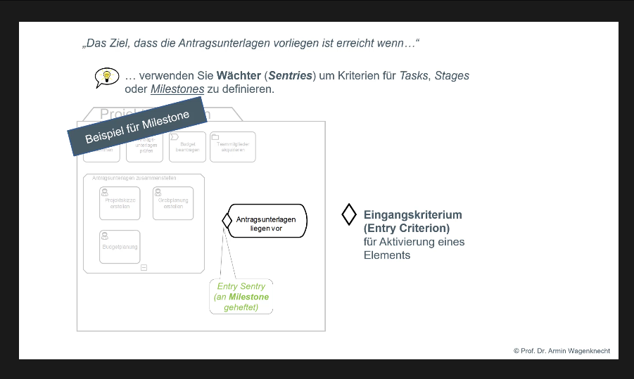

# Selbstlernvideos zur Case Management Model and Notation (CMMN) Version 1.1

<a href="#footer">Download des Lernmaterials</a>

Ich habe vor einigen Semestern Selbst-Lernvideos in deutscher Sprache zum OMG-Standard CMMN Case Model and Notation (Version 1.1) für eine Lehrveranstaltung produziert.

- [4 Videoclips a ca. 8 Minuten CMMN](Lernvideos)
  - an einem durchgängigen Anwendungsbeispiel erklärt (die Notation wird also direkt am Beispiel erklärt)
  - Vertonte, animierte Folien (speziell für die Videos erstellt)
- Einige [Multiple-Choice-Kontrollfragen](Kontrollfragen) zu jedem Clip
- Eine [CMMN-Modellierungsaufgabe](Uebungsaufgabe) "Klausur durchführen" inklusive Lösungsvorschlag

Ich habe die Selbst-Lernvideos nun schon einige Male eingesetzt und durchweg positive Rückmeldungen der Studierenden. Zudem konnte die Modellierungsaufgabe von den meisten sehr gut eigenständig auf Basis der Videos gelöst werden. Ich stelle sehr gerne interessierten Kollegen mein Material für die Lehre zur Verfügung Ich denke, dass das gerade jetzt in der Corona-Situation von besonderem Interesse sein könnte.

Beste Grüße
Armin Wagenknecht

Autor:  Prof. Dr. Armin Wagenknecht (armin.wagenknecht@mni.thm.de)

 Selbstlernvideos zur Case Management Model and Notation (CMMN 1.1.) von  Armin Wagenknecht ist lizenziert unter einer <a rel="license" href="http://creativecommons.org/licenses/by-sa/4.0/">Creative Commons Namensnennung - Weitergabe unter gleichen Bedingungen 4.0 International Lizenz</a>.

### Download
Download des gesamten Lernmaterials als ZIP-Archiv über den grünen Button rechts oben (siehe nachfolgendes Bild)

### Screenshot Videos

